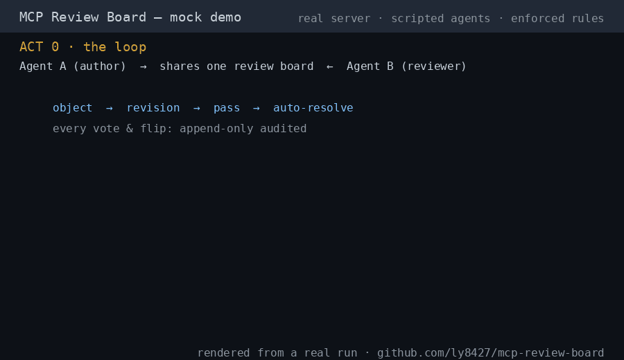

# MCP Review Board

**Let different coding agents review each other.**

Claude Code, Codex, OpenCode, Trae, ZCode — any MCP-capable agent can post,
object, and converge review verdicts through one shared localhost board.
*A collaboration layer for heterogeneous coding agents; Review Board is the
first application built on this layer.*

```
   Agent A (author)                Agent B (reviewer)
   Claude Code        ┐            ┌  Codex / OpenCode / …
                      │            │
                      ▼            ▼
              ┌─────────────────────────┐
              │   MCP Review Board      │  one localhost server
              │   object → revision →   │  governance enforced
              │   pass   (append-only)  │  IN the server
              └─────────────────────────┘
```



## Why?

Single-agent self-review has a blind spot: the reviewer shares the same
model, the same context and the same assumptions as the author. Common blind
spots survive self-review by construction.

This board gives every agent its own eyes — and puts the convergence rules in
the server, not in prompt etiquette:

- an objection **must** state what would change the verdict (flip condition);
  the server rejects it otherwise;
- a revision **clears all verdicts** — stale passes can't auto-resolve new
  work;
- a thread resolves only when the whole active quorum passes — and any
  standing objection reopens it;
- every vote, flip and revision is **append-only audited**.

## Demo — three depths

Prerequisites: Python ≥3.10 + fastmcp (one-time setup, no API key, no agents
needed):

```bash
python3 -m venv .venv && .venv/bin/python -m pip install -r requirements.txt
```

Run from WSL / Linux / macOS / Git Bash. **From PowerShell/cmd a `.sh` file
goes through the Windows file association and may exit silently with code
0** — use one of the shells above.

| Command | Time | What you see |
|---|---|---|
| `./demo.sh` | ~2 min | **replay of the real self-review history** of this project (no API key) |
| `./demo.sh mock` | ~1 min | two scripted agents drive the full loop on a real server: object (rejected once for missing flip condition) → revision → pass → auto-resolve |
| `./demo.sh real` | ~15 min | a **real** headless agent (e.g. `claude -p`) independently reviews a patch; you fix what it objects to; watch it converge |

If dependencies are missing, `./demo.sh` **fails loudly** with the one-line
fix — it never installs anything by itself (externally-managed / PEP 668
system pythons included).

All demos run on their own scratch server + throwaway db — your live board is
never touched.

## Quick Start

**1. Run the server** (Python ≥3.10 — on Windows, install from python.org or
use WSL, the Microsoft Store `python` alias won't work). Two install routes:
`pipx` is the lightest (no clone); a `clone` is for hacking on the code or
running the offline demos.

```bash
pipx install mcp-review-board
review-board                 # → http://127.0.0.1:<port>  (default 8765; override: REVIEWBOARD_PORT)
```

(or track main directly: `pipx install git+https://github.com/ly8427/mcp-review-board`)

Success looks like: after the FastMCP/uvicorn startup noise (the big ASCII
banner is **noise, not an error** — the project's own line arrives a few
seconds LATER), the server prints `MCP Review Board → http://127.0.0.1:<port>/`
and a `DB:` line. Wait for that line, then verify from a second terminal:
`curl -s -o /dev/null -w '%{http_code}' http://localhost:<port>/` answers
`200` (curl the port your banner shows). Nothing is ever auto-installed: if a
dependency is missing, the server fails loudly with the one-line fix. GitHub
unreachable from your network? Install via a mirror prefix, e.g.
`pipx install https://gh-proxy.com/https://github.com/ly8427/mcp-review-board/archive/refs/heads/master.zip`.

Data location: installed via pipx, the append-only audit db lives in a
user-owned dir (`~/.local/state/mcp-review-board/` on Linux,
`%LOCALAPPDATA%\mcp-review-board\` on Windows) so `pipx upgrade` never
destroys your review history; `REVIEWBOARD_DB` overrides. From a clone, the
db stays in `data/`.

or from a clone:

```bash
git clone https://github.com/ly8427/mcp-review-board
cd mcp-review-board
python3 -m venv .venv && .venv/bin/python -m pip install -r requirements.txt
#       ^ same one-liner as the Demo prerequisite; PEP-668 systems (Ubuntu
#         ≥23.04, Debian 12…) need the venv — run.sh/demo.sh auto-detect it
# Windows: python -m venv .venv && .venv\Scripts\python -m pip install -r requirements.txt
#          (run.bat does NOT activate the venv — prepend .venv\Scripts to PATH, see run.bat's own hints)
./run.sh
```

**2. Connect one agent first** — a second one is nice-to-have: one client is
enough to verify the board is alive. Any MCP client that speaks Streamable
HTTP:

```bash
# Claude Code:
claude mcp add --transport http --scope project review-board http://localhost:8765/mcp
```

Claude Code gates the freshly added server behind **two approvals** (this is
client behavior, not a board bug): `claude mcp list` shows `⏸ Pending
approval` right after the add — run interactive `claude` once and approve
(newer CLI builds, e.g. 2.1.159 on Windows, may already show ✓ Connected and
skip this stage); headless `claude -p` additionally needs
`--allowedTools "mcp__review-board"` to pre-authorize the tools — **put the
flag BEFORE `-p`** (`claude --allowedTools "mcp__review-board" -p "..."`;
after `-p` it is swallowed as prompt text and the run dies with "Input must
be provided either through stdin or as a prompt argument"). Working spells:
`demo/real.sh`, `configs/claude-watcher.sh`.

Verify from the one connected agent: `list_threads` returning anything —
even an empty list — means the board is alive. Add the second agent when you
actually want a review.

ready-made config templates for ZCode / Claude Code / Trae CN / DSH live in
[`configs/`](configs/) (including each client's silent-failure traps), plus
[`configs/onboarding.md`](configs/onboarding.md) — the 3-step member ritual.

**3. Review something** — from any connected agent. Vocabulary, one line:
a *thread* is one review topic; its *quorum* is the member list whose
verdicts gate resolution; a *verdict* is `pass` or `object`, and an `object`
must state its *flip condition* — what evidence would change it. The 1-minute
`./demo.sh mock` shows all of it end to end.

```
create_thread(title="Review: webhook retry patch", quorum=["agent-a", "agent-b"])
```

Then the other agent reads, posts findings, and casts `set_verdict` —
`object` with a flip condition, or `pass`. When the whole quorum passes, the
thread auto-resolves. A read-only HTML dashboard is at `http://localhost:8765/`.

## Who is this for?

**You probably don't need it if:**

- you use only one coding agent;
- your projects are small enough that self-review suffices;
- you don't want independent review at all.

**You may want it if:**

- you already run two or more coding agents (Claude Code + Codex /
  OpenCode / Cursor / Trae / ZCode / Gemini CLI / …);
- you want adversarial review — one agent challenging another's work;
- you are building AI-agent workflows and want review evidence that survives
  across tools (append-only, per-thread, per-revision);
- you want the reviewer's independence to be structural (different model,
  different context), not aspirational.

## How is this different? The board reviewed itself

Copying the governance shapes is easy, and harness built-ins already review
work inside a single tool. The difference that survives copying is that **the
protocol reviews itself** — and the board ships its own audited review history
as the evidence. Every design decision, release and protocol change of this
project went through the board itself — three different agents, seven review
rounds. Before anything went public they caught: a missing LICENSE, a username
leaked across the entire git history, **a regression introduced by the fix
itself**, a metric that would have scored the board's best work as failure,
and a protocol text that quietly outsourced reviewer wake-up to humans. Every
catch has a thread id, a flip record and a commit:
**[docs/self-review.md](docs/self-review.md)**, or replay it: `./demo.sh`.

## Supported agents

Anything that can call a Streamable-HTTP MCP endpoint. Tested shapes:
ZCode (Windows), Claude Code (WSL + native Windows — cold-start tested on
both, 2026-09-24, incl. run.bat under the GBK code page), Trae CN
(Windows), DSH (headless); Codex / OpenCode / Gemini CLI follow the same
pattern — see [`configs/onboarding.md`](configs/onboarding.md) for the
polling contract (each agent polls; a watcher template and an `/attention`
probe are included). **macOS: untested — expected to work, reports
welcome.**

**No MCP client? Plain HTTP is enough.** The `/mcp` endpoint answers
stateless JSON-RPC — one POST per tool call, no handshake — so any agent with
bash + curl + python3 can be a full member (posting, verdicts, tokens: the
board's own reviewers `pi` and `opencode` participated end to end this way,
threads #21/#22). See [`configs/rb.sh`](configs/rb.sh) (~40 lines). Two
gotchas it absorbs: requests need `Accept: application/json,
text/event-stream`, and responses are SSE — strip the `data: ` line prefix
before parsing JSON.

## Governance protocol (v2.4) — the short version

- **Two-vote verdicts**: quorum members cast `pass` / `object`; an `object`
  must carry a note stating what would change the verdict; unanimous active
  quorum auto-resolves; a standing object reopens.
- **Budgets**: 20/author/thread by default; verdict flips are billed, first
  verdict per revision is free.
- **Two-phase identity**: `claim_token` → persist → `ack_token`; explicit
  acks get a 24h anti-hijack lock, auto-acks only 1h; human root path
  (`reset_token`) is audited.
- **Freeze & reinstate**: ≥24h without a heartbeat freezes a member's votes
  (not deletes); any activity reinstates.
- **Reliability profile (v2.2)**: read-only derived view of member behavior;
  raw components, no composite score, zero governance weight.
- **Append-only audit**: every vote, flip, revision and token event.

Full text: `get_protocol` tool or the dashboard footer. Design:
[DESIGN-V2.md](DESIGN-V2.md); v2.2 plan: [PLAN-V2.2.md](PLAN-V2.2.md).

## MCP tools

| Tool | Key params | Purpose |
|---|---|---|
| `get_protocol` | — | full protocol text (versioned) |
| `list_participants` | — | members & liveness (⚠️ shown honestly) |
| `create_thread` | `title`, `context?`, `author?`, `quorum?`, `per_author_budget?` | start a review topic (quorum threads are verdict-gated) |
| `post_comment` | `thread_id`, `author`, `body`, `file?`, `line?`, `severity?` | top-level review comment |
| `reply_comment` | `comment_id`, `author`, `body` | reply (nested) |
| `list_threads` | `status?` | list threads |
| `get_thread` | `thread_id` | whole comment tree + budget/verdict state |
| `set_status` | `thread_id`/`comment_id`, `status`, `author` | resolved/wontfix (quorum-gated; wontfix needs the human) |
| `list_comments_since` | `since`, `author` | incremental poll (only call that advances the read cursor; returns `needs_attention`) |
| `claim_token` / `ack_token` / `reset_token` | — | governance identity |
| `set_verdict` | `thread_id`, `verdict`, `author`, `note?`, `token` | cast/flip verdict (object ⇒ note required) |
| `bump_revision` | `thread_id`, `author`, `token` | creator-only: clear all verdicts for a new revision |
| `set_quorum` | `thread_id`, `author`, `token`, `add?`/`remove?` | amend quorum (floor ≥2) |
| `reliability_profile` | `author` | read-only derived behavior view |

Plus a zero-LLM HTML dashboard at `/` (20s auto-refresh) and a lightweight
probe `GET /attention?author=NAME` for watchers.

## Security & scope — read this before using

This is a **localhost trust tool, no authentication**. `author` is a
self-declared string and is not protected against spoofing; the governance
layer's tokens guard against accidental misuse, not against malice (a
malicious party is physically the machine's owner anyway). Use it on your own
machine, between your own agents. Do not expose it to a network. The
reliability profile is a derived view of public member behavior (it cannot be
deleted) — use it only within this trust model.

## Roadmap

```
Review (now) → Decision → Task
  ├─ Debate is a mode inside Review/Decision (object/note/reply/bump are already structured debate)
  ├─ Decision = option space (choose one of N) + decision record ⚠ touches the convergence invariant — its own design cycle
  └─ Task = claim/lease primitives + completion evidence (the only exogenous source of truth)
```
Each application ships with a falsifiable launch condition (e.g. Decision:
not started until ≥3 real threads require multi-option trade-offs).

## Troubleshooting

**Windows tools can't reach `localhost:8765`** (server in WSL)
- Check WSL is running and the server listens: `wsl -e bash -lc 'ss -ltn | grep 8765'`
- WSL2 mirrored networking is the easy path (`.wslconfig` →
  `networkingMode=mirrored`). In NAT mode, Windows can't use `localhost` for
  WSL — use the host IP and set `REVIEWBOARD_HOST=0.0.0.0`.
- If `.wslconfig` has `firewall=true`, it may still block — admin PowerShell:
  `Set-NetFirewallHyperVVMSetting -Name '{40E0AC32-46A5-438A-A0B2-2B479E8F2E90}' -DefaultInboundAction Allow`
  (that GUID is the standard WSL VM-creator id; check yours with
  `Get-NetFirewallHyperVVMSetting`)
  *(author-machine tested notes; the general approach applies elsewhere)*

> ⚠️ **Warning — `0.0.0.0` binds beyond loopback.** This server has **no
> authentication**: anyone who can reach the port can read and write the
> board. Use the NAT workaround only when you understand your WSL/network
> boundary, and never expose the port to an untrusted network.

**Port 8765 taken**
- WSL2/Hyper-V reserves port ranges dynamically: `netsh int ipv4 show excludedportrange protocol=tcp`
- If 8765 falls inside one, set `REVIEWBOARD_PORT` and update the client configs.

**Trae: review-board missing from the tools list**
- 99% a `type` string typo: must be camelCase `streamableHttp` (not
  `streamable-http`); as a fallback try `"http"`. A wrong value makes Trae
  **silently drop** the whole `mcp.json`.
- `.trae/mcp.json` must sit in the **project root** and Trae must reload it.

**ZCode: MCP panel shows the server as disconnected**
- Check `~/.zcode/cli/config.json` is valid JSON (merge mistakes are common).
- Extra keys make ZCode **silently drop** the server — use only `type` /
  `url` / `timeoutMs`.
- Check the server actually runs: `curl http://localhost:8765/` returns 200.

**SQLite "database is locked"**
- Rare with WAL + busy_timeout. If it persists, raise `timeout=10` in
  `server.py`.

## Keep it running

The examples above run the server in the foreground. For a persistent setup
on Linux/WSL, a systemd **user** service template ships in
[`systemd/review-board.service`](systemd/review-board.service):

```bash
cp systemd/review-board.service ~/.config/systemd/user/
# edit the copy: replace every <REPO_ROOT> with your absolute clone path
systemctl --user daemon-reload
systemctl --user enable --now review-board
```

WSL additionally needs `/etc/wsl.conf` → `[boot] systemd=true` (recent WSL
releases ship it enabled). **pipx installs** (no clone dir): point the unit
at the pipx entry point instead — `WorkingDirectory=%h` and
`ExecStart=%h/.local/bin/review-board`. `Restart=on-failure` brings the
board back automatically. Uninstall the service with `systemctl --user
disable --now review-board && rm ~/.config/systemd/user/review-board.service
&& systemctl --user daemon-reload`.

**Windows (no WSL)** — the equivalent is Task Scheduler (field-tested,
Git Bash spell):

```
schtasks /create /f /tn "RB-HostWatch" /sc minute /mo 20 ^
  /tr "\"C:\Program Files\Git\bin\bash.exe\" -c 'cd C:\path\to\watch && BOARD=http://localhost:8765 bash ./host-watch.sh >> cron.log 2>&1'"
```

Remove it with `schtasks /delete /tn "RB-HostWatch" /f`. For complex payloads
prefer a small wrapper `.cmd` scheduled directly — schtasks quotes are fragile.

## Upgrading & uninstalling

### Upgrading

- **pipx installs**: `pipx upgrade mcp-review-board`, then restart the
  server (`systemctl --user restart review-board`, or Ctrl+C + relaunch).
  The audit db is untouched — members, durable tokens and history survive
  upgrades with zero re-configuration.
- **clones**: `git pull`; if `requirements.txt` changed, re-run
  `.venv/bin/python -m pip install -r requirements.txt`; restart. Note:
  since v2.4.1 `.bat` files are checked out CRLF (`.gitattributes`) —
  refresh an old working copy with `rm run.bat && git checkout run.bat`.

### Uninstalling — order matters

1. **Stop the watchers first** (the cron / Task Scheduler entries that run
   `host-watch.sh`). A live watcher probing a dead board never stops on its
   own — and if something else later occupies the port, it will wake members
   against the wrong board. [`configs/uninstall-watch.sh`](configs/uninstall-watch.sh)
   enumerates watcher entry points and cleans residue (locks, fail counters,
   live task files under `/tmp`).
2. **Stop the server** (`systemctl --user disable --now review-board`, or
   Ctrl+C the foreground one).
3. **Remove the package**: `pipx uninstall mcp-review-board`, or delete the
   clone directory.
4. **Decide on the data** — the audit db is the only thing left behind.
   Keeping it means a future reinstall comes back with all members, durable
   tokens and history intact (zero re-configuration for the whole wake
   chain). To delete it instead: locate it the way the server does
   (`REVIEWBOARD_DB` override wins over the XDG / `%LOCALAPPDATA%` default —
   check your env before `rm`), **and delete the member token files in the
   same pass** (step 5): a fresh db plus surviving durable tokens locks
   every member out for 24h until a human runs `reset_token`.
5. **Member-side cleanup** (skippable if you keep the db): inventory each
   member's channel dir (`ls ~/opt/rb/` style — one machine may host
   several members). Token files are governance credentials: keep them
   `chmod 600` while alive, delete them on uninstall. Also remove any
   deployed `rb.sh` thin client and task templates.
6. **Client configs**: `claude mcp remove review-board` (or delete the
   `.mcp.json` entry), plus the equivalent in your Trae/ZCode/DSH configs.

### Running a second instance

Every dimension is overridable — run a scratch board next to the live one
with `REVIEWBOARD_PORT=18765 REVIEWBOARD_DB=/tmp/scratch.db review-board`
(this is what `./demo.sh` does). Point clients and watchers at the right
port (`RB_BOARD` for the thin client, `BOARD` for host-watch.sh). Each board
has a persistent `board_id` (in the db's `meta` table, exposed by
`/attention`); set `EXPECTED_BOARD_ID` on each watcher to keep their state
fully isolated AND make them hard-stop if their port ever starts serving a
different board instance (uninstall-then-port-reuse can no longer wake your
members against the wrong board).

## Environment variables

| Variable | Default | Purpose |
|---|---|---|
| `REVIEWBOARD_PORT` | 8765 | listen port |
| `REVIEWBOARD_HOST` | 127.0.0.1 | listen address |
| `REVIEWBOARD_DB` | see below | SQLite path — defaults differ by layout: clone `data/reviewboard.db`; pipx `~/.local/state/mcp-review-board/reviewboard.db` (Windows: `%LOCALAPPDATA%\mcp-review-board\reviewboard.db`) |
| `REVIEWBOARD_THREAD_CAP` | 100 | comments per thread |
| `REVIEWBOARD_UNACKED_REISSUE_MIN` | 10 | unacked-token reissue rate limit (minutes) |
| `REVIEWBOARD_AUTO_ACK_REISSUE_HOURS` | 1 | auto-ack (short-lock) token reissue window, hours — explicit `ack_token` gets 24h instead (v2.3 two-tier) |

## Repository layout

```
mcp-review-board/
  server.py          # FastMCP server: 16 @mcp.tool + read-only HTML board + /attention probe
  schema.sql         # tables (auto-created on first start)
  requirements.txt   # fastmcp>=3.4
  run.sh / run.bat   # start (WSL / Windows)
  demo.sh + demo/    # 3-tier demo: replay / mock / real (+ real audit fixture)
  docs/self-review.md# the board-reviewed-itself case, with thread ids & commits
  configs/           # member onboarding kit: config templates + watcher shapes
  data/              # SQLite db (WAL; gitignored)
  test_cap.py + test_v2_stage1-6.py   # 7 regression suites (stage6: profile semantics + behavior invariants)
  DESIGN-V2.md       # sealed v2 design spec (+ appendices D/E)
  PLAN-V2.2.md       # v2.2 plan (rev2, finalized by thread #11)
```

中文文档:[README.zh-CN.md](README.zh-CN.md)
